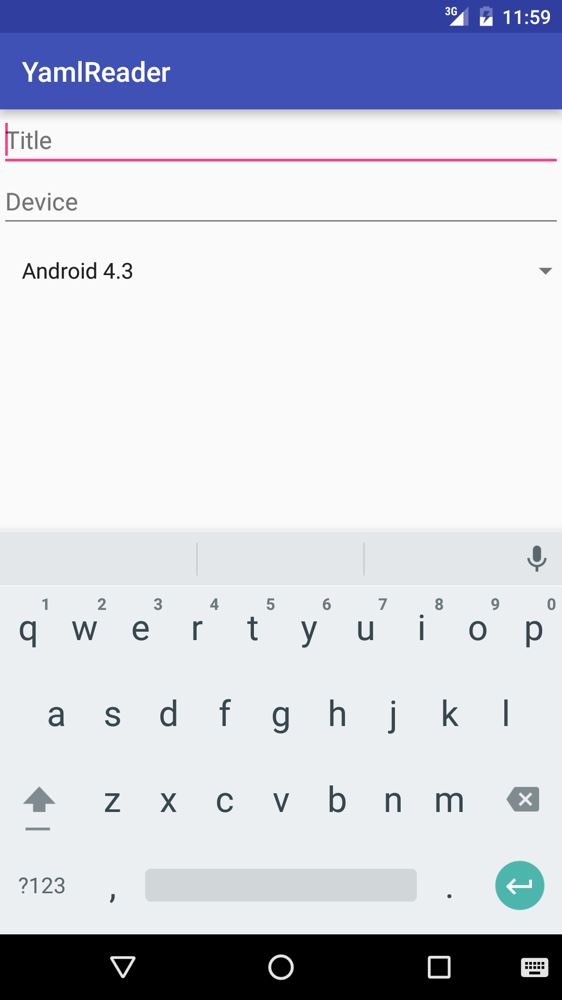

# YamlFormBuilder

You build form easliy, just write a yaml file!

```yaml
config:
  version: 1
form:
 - key: "title"
   type: textfield
   label: "Issue title"
   params:
    hint: "Title"
    max: 100
    multiline: false
 - key: "device"
   type: textfield
   label: "Device"
   params:
    hint: "Device"
    max: 100
    multiline: false
 - key: title
   type: selector
   label: "Select android version"
   params:
     values:
      - Android 4.3
      - Android 4.4
      - Android 5.0
      - Android 6.0
     mode: simple
```

And initialize yout fragment:

```java
public class SampleFormFragment extends YamlFormFragment {
  @Override
  protected InputStream getFormInputStream() {
    return getResources().openRawResource(R.raw.form);
  }
}
```

And that's it!


